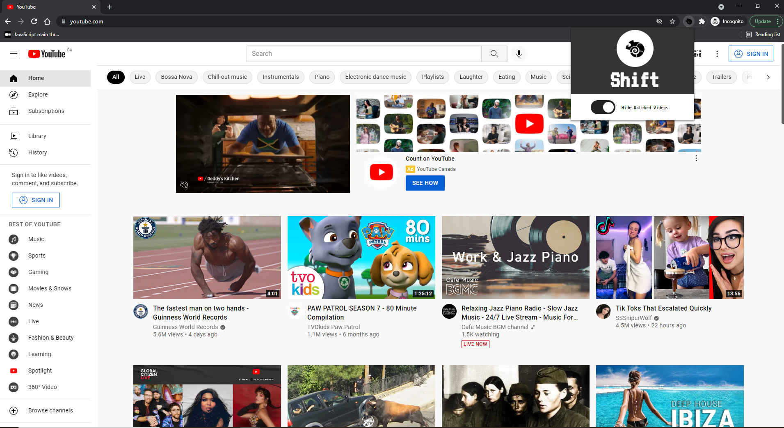

# shift-yt-optimizer Chrome Extension 

# Published**
https://chrome.google.com/webstore/detail/shift-youtube-optimizer/hfndjegliabemhpfcdecfehlipjdnecp
**Update Pending Review**

Chrome extension to hide/reduce the number of videos shown on YouTube.

As the summary above states, this is a simple open-source chrome extension written in vanilla JavaScript, CSS and of course, HTML, using the Chrome Extension format, although shortly there should be an extension for Firefox as well. I noticed a number of other Chrome Extensions that were similar but they all only worked on the homepage, so I decided to make one that worked all over the site, and didn't need the mouse to scroll before it would activate.

I spent a few days looking into how YouTube sets up the front-end of their website, so if anyone has any questions, feel free to shoot me a message. Also, if anyone would like to check out the source-code, or contribute to make it even better (or fix bugs), you've come to the right place.

# Features

-Hides all watched YouTube videos only on the youtube.com website. Tested and working pages include the homepage, user's channels, playlists, watching a video, search results page, and the explore/trending pages.

-**Coming Soon**
'Work Mode' : Predefine a list of channels/tags that you would like to allow videos from, and hide everything else. Great for work in a professional setting, or teachers who don't want to create multiple accounts.
